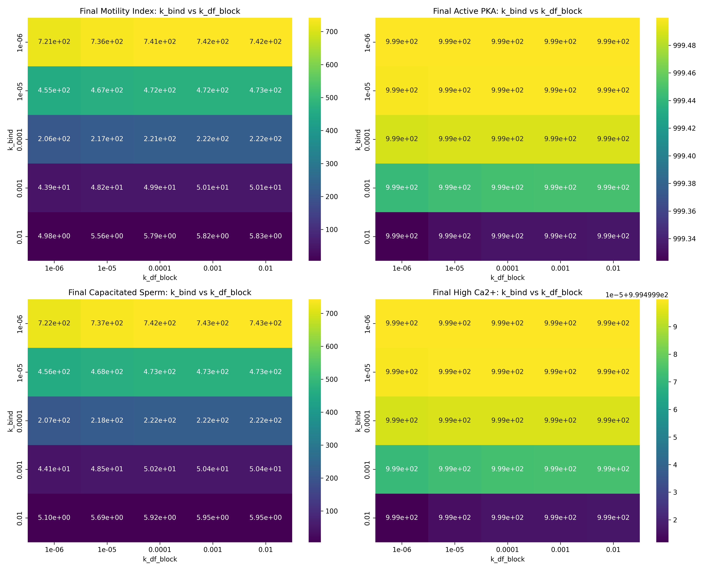

# Sperm Motility PySB Simulation
This repository contains a PySB model simulating sperm capacitation with an emphasis on motility dynamics under varying biochemical influences. It is a personal project aimed at learning how to implement biochemical modelling in python and revisions will be made in perpetuity.

## Features

- Mechanistic biochemical model built with [PySB](https://pysb.org/)
- Parameter sweep with parallel simulation using `multiprocessing`
- Speedup via Cython compilation (fallbacks included)
- Multivariate parameter sensitivity analysis
- Interactive 3D plotting and publication-quality heatmaps

---

## Installation

```bash
git clone https://github.com/Moses-Muchiri/Capacitation_Modelling.git
cd capacitation-modelling
```

Make sure you have:
- [Cython](https://cython.org/)
- [Microsoft C++ Build Tools](https://visualstudio.microsoft.com/visual-cpp-build-tools/) or GCC
- [BioNetGen (Windows download)](https://bionetgen.org/index.php/Download)
- [Strawberry Perl (for Windows)](https://strawberryperl.com/)


---

## Running Simulations

```bash
python app.py
```

Results are saved automatically in the `output/` directory.

---

## Output Artifacts

This simulation generates the following outputs in the `output/` directory:

### CSV & HTML Results

- [`motility_results_parallel.csv`](./output/motility_results_parallel.csv): All parameter combinations and their simulation outcomes.
- [`parameter_sensitivity.csv`](./output/parameter_sensitivity.csv): Correlation-based sensitivity analysis.
- [`3d_scatter_motility.html`](./output/3d_scatter_motility.html): Interactive 3D scatter plot.

### Visualizations

Motility trends and sensitivity visualizations:

| Visualization | Preview |
|---------------|---------|
| `motility_vs_cAMP_boost_enhanced.png` |  |
| `correlation_matrix.png` |  |
| `sensitivity_analysis.png` |  |
| `comprehensive_heatmaps.png` |  |

---

## Parameter Space

The model sweeps across:
- `k_bind`: DF binding rate
- `k_unbind`: DF unbinding rate
- `k_df_block`: DF-blocking rate by inhibitor
- `k_cAMP_boost`: Drug-induced boost of cAMP production

Each combination is evaluated on its impact on the **Motility Index** and **Active PKA** levels.

---

## Sensitivity Analysis

Using correlation coefficients, parameter impact is quantified and saved in:

- `parameter_sensitivity.csv`
- `correlation_matrix.png`
- `sensitivity_analysis.png`

---

## Author

Muchirii – [@mosesmuchirijr](https://www.linkedin.com/in/moses-muchiri-jr)

---

## License

MIT License
